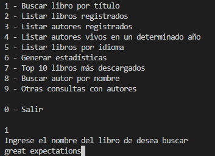
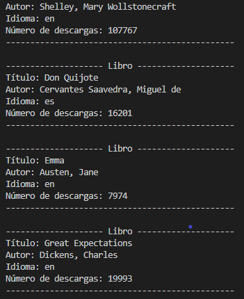
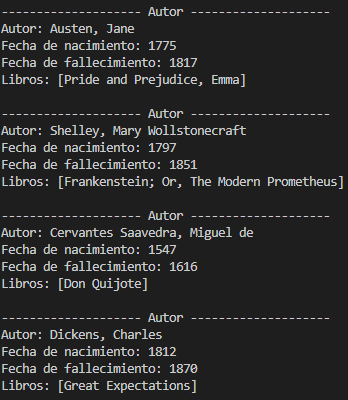

# Challenge LiterAlura

 

LiterAlura es una aplicación de consola desarrollada en Java usando Spring Framework que tiene diferentes funciones como buscar libros, listarlos, buscar autores, etc. La aplicación se conecta a la API de [Gutendex](https://gutendex.com/) para obtener la información de los libros y utiliza una base de datos PostgreSQL para almacenar los datos.

## Funciones
1. **Buscar libros por título**
2. **Listar libros registrados**
3. **Listar autores registrados**
4. **Listar autores vivos en un determinado año**
5. **Listar libros por idioma**
6. **Generar estadísticas**
7. **Top 10 libros más descargados**
8. **Buscar autor por nombre**
9. **Otras consultas con autores**

## Requisitos
- Java 21
- Spring Framework 3.4.1
- PostgreSQL

## Imágenes del proyecto
### Opción 1: Buscar libro

### Opción 2: Listar libros

### Opción 3: Lista autores
